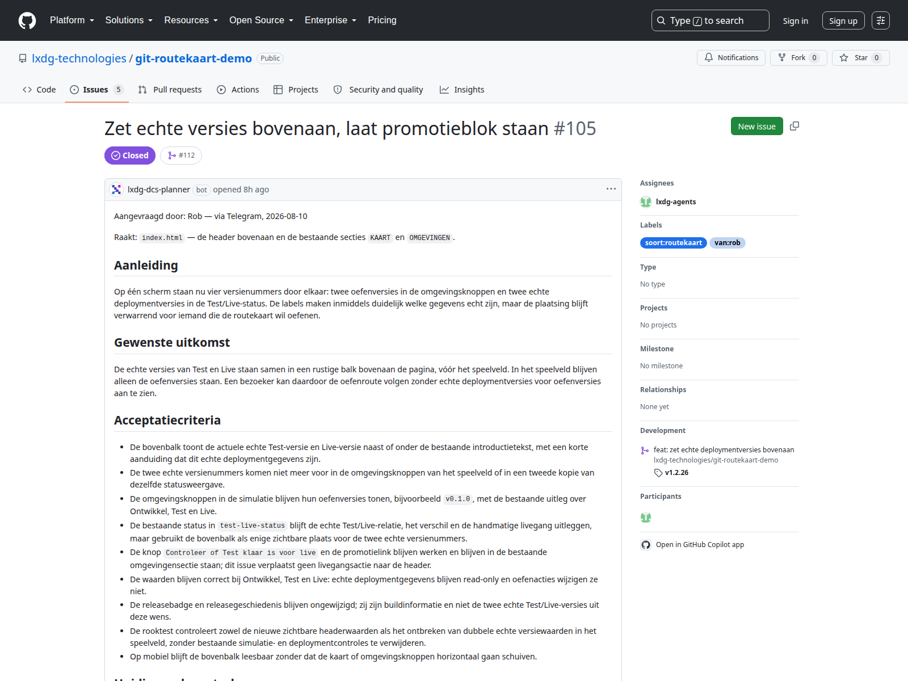
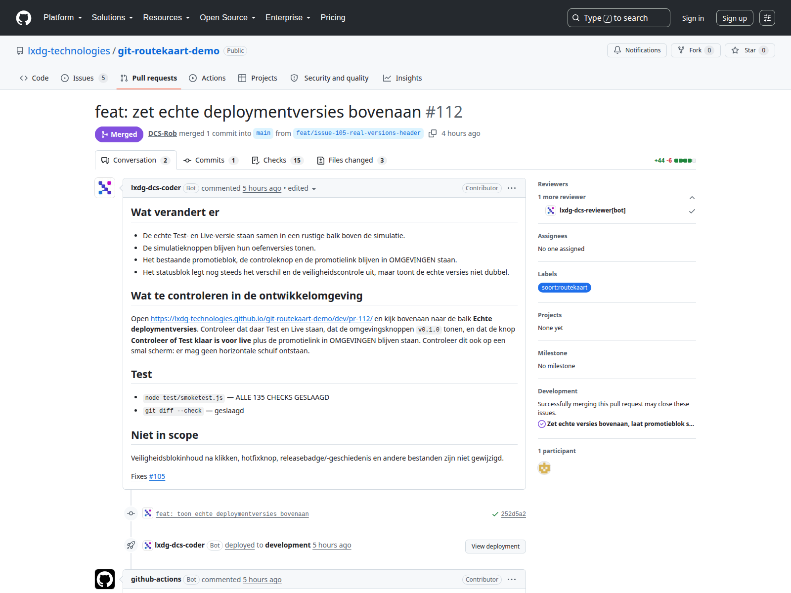
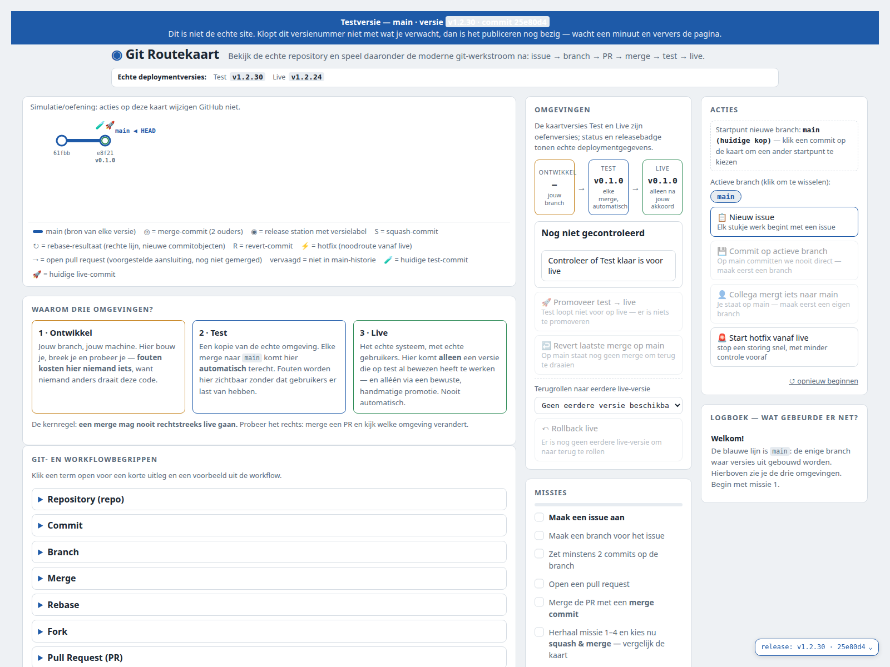
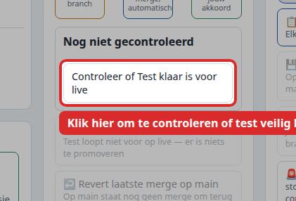
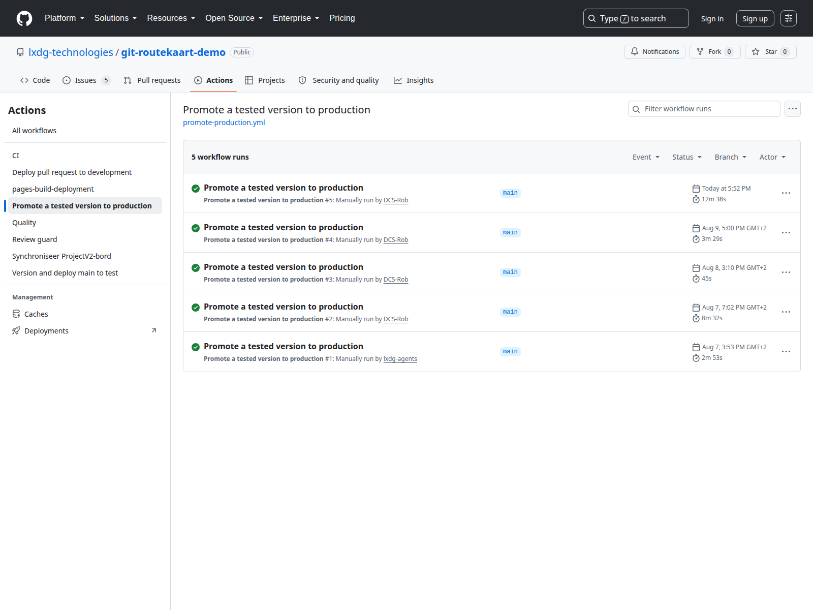
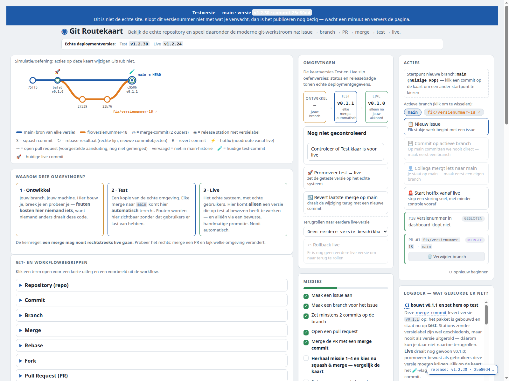
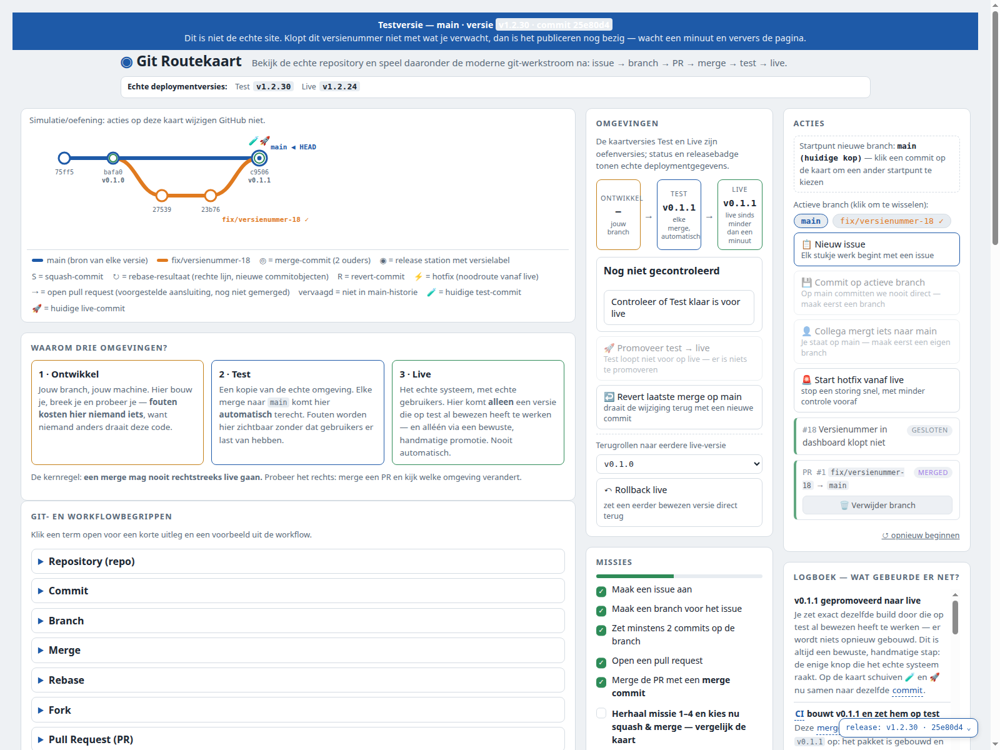

> Route 1 van 7. Terug naar de [Handleiding - start](start.md) · Achtergrond: [WERKWIJZE.md](../WERKWIJZE.md)

## Wanneer gebruik je dit

Je hebt een wens, of je ziet iets misgaan op de pagina, en het moet uiteindelijk zichtbaar worden voor bezoekers. Dit is de gewone route. Negen van de tien keer is dit de goede.

**Niet deze route** als er nú iets stuk is op de echte site — dan is het [Handleiding 2 - Er is iets stuk op live](route-2-storing-op-live.md).

## Voordat je begint

- Een GitHub-account met schrijfrechten op `git-routekaart-demo`.
- Voor de laatste stap heb je **de repository-eigenaar** nodig. Zij zijn de enige twee die iets live mogen zetten.
- Reken op een half uur van begin tot op test. Live zetten kan daarna op elk moment.

---

## Stap 1 — Zeg wat er moet gebeuren

**Wat je doet:** stuur de issuebeheerder één regel via de afgesproken issue-route. Bijvoorbeeld: *"de knop rechtsboven doet niks"* of *"kun je issue 84 oppakken"*.

**Wat je hoort te zien:** de issuebeheerder antwoordt met een issue dat hij heeft aangemaakt, en stelt één vervolgstap voor.

**Klopt het niet:** krijg je geen antwoord, dan staat jouw contactgegevens waarschijnlijk niet in zijn lijst. Vraag de repository-eigenaar dat toe te voegen — zonder dat hoort hij je niet.

*Liever zelf?* Ga naar de [issues](https://github.com/lxdg-technologies/git-routekaart-demo/issues) en klik **New issue**. Je krijgt een formulier met vaste vragen: wat gaat er mis, wat zag je, wat kost het, wanneer is het klaar, wat hoort er níét bij.

*Je hoort hier te zien: links de tekst van het issue, rechts de labels, en onder **Development** de pull request die eraan hangt zodra er gebouwd wordt.*

## Stap 2 — Wachten tot het bouwklaar is

**Wat je doet:** niets. de issuebeheerder controleert het issue tegen de echte code, zet het soort-label en zet het op **Ready**.

**Wat je hoort te zien:** de kaart staat op het [projectbord](https://github.com/lxdg-technologies/git-routekaart-demo/issues) in de kolom **Ready**.

**Klopt het niet:** blijft de kaart in **Backlog** staan, dan wacht de issuebeheerder op een antwoord van jou. Kijk in het issue of de issuebeheerder iets gevraagd heeft.

## Stap 3 — Er wordt gebouwd

**Wat je doet:** zeg tegen de issuebeheerder dat hij Coder mag starten. Meer is het niet — één zin via de afgesproken issue-route, bijvoorbeeld *"ja, laat maar bouwen"*.

Zelf een agent starten kun je niet, en dat hoeft ook niet. Dat gaat via een opdracht op de machine van de agents en is voorbehouden aan Claude en de repository-eigenaar.

**Wat je hoort te zien:** binnen enkele minuten schuift de kaart naar **In progress**, en er verschijnt een pull request in de lijst.

**Klopt het niet:**
- Blijft het meer dan een half uur stil, vraag dan hoe het staat. Er draait er altijd maar één Coder tegelijk, dus het kan zijn dat hij nog aan iets anders bezig is.
- Zegt de issuebeheerder dat hij eerst jouw akkoord wil op de tekst van het issue, geef dat dan eerst. Hij begint bewust niet uit zichzelf.

## Stap 4 — Kijken vóór het samenvoegen

**Wat je doet:** open de pull request en klik het adres aan dat in de tekst staat, onder *waar is het te zien*. Dat is de ontwikkelomgeving: `…/dev/pr-<nummer>/`.

**Wat je hoort te zien:** een kopie van de pagina met alleen deze wijziging erin, en een oranje balk bovenaan met het pull request-nummer.

**Klopt het niet:**
- Zie je een oude versie? Wacht een minuut; publiceren duurt even.
- Staat er "klik op Test" in plaats van een adres? Dat is de simulatieknop, niet de testomgeving. Vraag om het echte adres.
- **Gaat de wijziging over echte versienummers of echte status?** Dan kun je dat hier niet controleren — in de ontwikkelomgeving staan bewust voorbeeldgegevens. Dat kan pas op test.

*Je hoort hier te zien: bovenaan de titel en de status, en welke branch wordt samengevoegd.*

## Stap 5 — De beoordeling

**Wat je doet:** niets. De beoordelaar start vanzelf zodra Coder klaar is.

**Wat je hoort te zien:** binnen vier tot acht minuten staat er een beoordeling onderaan de pull request, met een blok **VOOR DE EIGENAAR**: wat is er veranderd, waar je het ziet, wat ik je vraag.

**Klopt het niet:** vraagt de beoordelaar wijzigingen, ga dan naar [Handleiding 5 - De beoordeling vraagt wijzigingen](route-5-beoordeling-vraagt-wijzigingen.md).

## Stap 6 — Samenvoegen

**Wat je doet:** klik **Squash and merge**, en daarna **Delete branch**.

**Wat je hoort te zien:** de pull request kleurt paars met *Merged*, en de kaart op het bord gaat naar **Done**.

**Klopt het niet:**
- Is de knop grijs? Kijk of `quality` groen is. Dat is de enige controle die tegenhoudt.
- Staat `review-guard` op rood? Dat mag; die blokkeert niet. Ga gerust door.
- Vergeet **Delete branch** niet. Het gebeurt niet vanzelf, en er staan er nu al 56.

## Stap 7 — Automatisch naar test

**Wat je doet:** niets. Wacht ongeveer een halve minuut.

**Wat je hoort te zien:** op `…/test/version.json` staat een nieuw versienummer. Op de testpagina staat het bovenin in de balk **Echte deploymentversies**.

**Klopt het niet:** staat er na twee minuten nog een oud nummer, open dan [Version and deploy main to test](https://github.com/lxdg-technologies/git-routekaart-demo/actions/workflows/deploy-test.yml) en kijk naar de lijst.

Zie je daar meerdere runs op **queued** of **pending** staan, dan is er niets stuk — ze staan in de rij achter elkaar. De publicatie naar test en de ontwikkelomgeving van elke pull request delen één plek, en die komt niet vrij zolang er één run blijft hangen.

**Wat je dan doet:** zoek de **oudste** run die nog op *queued* staat en breek díé af. Niet de nieuwste — die is het slachtoffer, niet de oorzaak. Zodra de oudste weg is, lopen de rest en jouw publicatie vanzelf door.

Dat is in de nacht van 11-08 gemeten: één run stond ruim vier uur in de wachtrij, en test bleef daardoor vier versies achter zonder dat er ergens een foutmelding stond. Er komt geen melding en geen rood kruis — alleen stilte. Kijk dus bij twijfel altijd in die lijst.

*Je hoort hier te zien: bovenin de balk met **Echte deploymentversies**, met het nieuwe testnummer naast het oude livenummer.*

## Stap 8 — Kijken of het veilig kan

**Wat je doet:** ga naar `…/test/`, zoek het blok **OMGEVINGEN**, en klik **Controleer of Test klaar is voor live**.

**Wat je hoort te zien:** één regel met het antwoord — **✓ Veilig om live te zetten** — en daaronder drie voorwaarden met een vinkje of een open rondje. Pas dan verschijnt de knop naar de promotie.

**Klopt het niet:** staat er **! Nog niet veilig**, zet dan niets live. Eronder staat wat er eerst moet gebeuren.

*Je hoort hier te zien: de knop staat onder het blok dat begint met "Nog niet gecontroleerd". Dit is de enige knop op de pagina die een echte controle uitvoert.*

## Stap 9 — Live zetten

**Wat je doet:** vraag het aan **de repository-eigenaar** en stuur het adres van de pull request mee. Zij zijn de enige twee die dit mogen. Wat zij doen:

1. Actions → *Promote a tested version to production* → **Run workflow**
2. Het versieveld **leeg laten** — leeg betekent: neem wat er nu op test staat
3. Vinkje *I understand that this version will replace production*
4. Groene **Run workflow**
5. De run opent, dan **Review deployments** → `live` aanvinken → **Approve and deploy**

Stap 5 is de enige die echt telt. De rest is navigatie.

**Wat je hoort te zien:** de run kleurt groen en op `…/version.json` staat binnen enkele minuten het nieuwe versienummer.

**Klopt het niet:**
- Blijft de run op **Waiting** staan? Dan wacht hij op de goedkeuring uit punt 5. Er is niets stuk; er moet iemand drukken.
- Faalt de run met een melding over een versie? Dan komt wat op test staat niet overeen met wat er is opgeslagen. Zet niets live en meld het.
- **Is de run groen, maar staat er op de site nog het oude versienummer?** Dan is jouw deel gelukt en hangt het erna. Kijk in **Actions** naar de run *pages build and deployment* die vlak na de jouwe staat. Zie je daar *build* en *report-build-status* met een tijd erbij, maar bij **deploy** geen tijd en de status **Queued**, dan is het werk af en heeft alleen niemand het opgepakt. Er verschijnt geen foutmelding en geen rood kruis — alleen een oud versienummer. **Meld het; het lost zichzelf niet op.** Op 11-08 stond zo'n run een uur stil.

> [!warning] Groen bij jou betekent nog niet live
> De promotie en de publicatie zijn twee losse dingen. De promotie kan in 34 seconden slagen terwijl de bezoeker nog dagenlang de oude versie ziet. **Controleer daarom altijd `…/version.json`**, en vertrouw nooit op de kleur van je eigen run.

*Je hoort hier te zien: de lijst met alle keren dat er iets live is gezet. **De knop Run workflow staat niet op deze afdruk** omdat de browser die hem maakte niet was ingelogd; bij jou staat hij rechtsboven.*

## Eindcontrole

Je bent klaar als deze drie kloppen:

1. Op `…/version.json` staat het nieuwe versienummer.
2. Op de echte site zie je de wijziging waar je om vroeg.
3. De kaart op het bord staat op **Done** en in de groep **Live**.

Klopt één daarvan niet, dan is het niet af — hoe groen alles er verder ook uitziet.

## Wat de simulatie hiervan laat zien

Op de routekaartpagina zijn dit **missie 1 tot en met 9**. Speel ze in volgorde; het duurt twee minuten en je ziet precies wat er in het echt gebeurt.

De kern zit in missie 8. Na het samenvoegen springt **TEST** naar de nieuwe versie en blijft **LIVE** staan:

*Je hoort hier te zien: de oranje zijtak komt samen op een station `v0.1.1`, en rechts staat TEST op `v0.1.1` terwijl LIVE nog op `v0.1.0` staat.*

Pas na missie 9 — bewust promoveren — staan ze allebei gelijk:

*Je hoort hier te zien: TEST en LIVE allebei op `v0.1.1`.*
