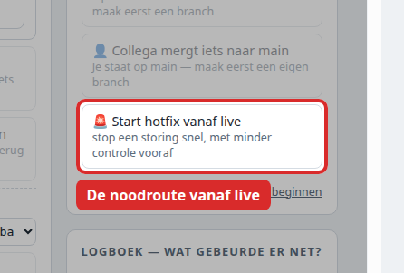

> Route 2 van 7. Terug naar de [Handleiding - start](start.md) · Vaste vorm: [Handleiding - sjabloon voor een route](sjabloon.md)

> [!warning] Dit is de minst beproefde route
> De gewone route naar live is tientallen keren gelopen. Deze niet: er is nog nooit een echte hotfix geweest. Wat hieronder staat klopt met hoe de omgeving is ingericht, maar is niet in het echt doorlopen. Loop je hier tegen iets aan, meld het — dan wordt deze route beter.

## Wanneer gebruik je dit

Bezoekers zien nú iets kapots op de echte site. Niet iets dat beter kan, maar iets dat stuk is.

**Niet deze route** als het ongemakkelijk maar werkend is — dan is het [Handleiding 1 - Van wens naar live](route-1-van-wens-naar-live.md). Haast maakt fouten, en de gewone route duurt maar een half uur.

## Voordat je begint

- **de repository-eigenaar moet erbij.** Elke weg naar live loopt via hun goedkeuring; ook een spoedreparatie.
- Bedenk eerst welke van de twee wegen je neemt. Dat scheelt de meeste tijd:

| | Wanneer | Hoe lang |
|---|---|---|
| **Terugzetten** naar de vorige versie | Het ging stuk door iets dat net live is gezet | Minuten |
| **Repareren** en vooruit | Het is er altijd al geweest, of terugzetten kan niet | Half uur |

Terugzetten is bijna altijd de betere eerste stap: je bent snel weer in een toestand die bewezen werkte, en daarna kun je rustig repareren.

---

## Stap 1 — Vaststellen wat er stuk is

**Wat je doet:** open de echte site en schrijf op wat je ziet. Open daarna `…/test/` en kijk of het daar ook zo is.

**Wat je hoort te zien:** een verschil. Staat het probleem alleen op live en niet op test, dan is er iets misgegaan bij het live zetten. Staat het op allebei, dan zit het in de code.

**Klopt het niet:** zie je op geen van beide iets, vraag dan aan degene die het meldde om een schermafdruk. Repareer nooit iets wat je niet zelf hebt gezien.

## Stap 2 — Kijken wat er als laatste live is gegaan

**Wat je doet:** open `https://lxdg-technologies.github.io/git-routekaart-demo/version.json` en noteer het versienummer. Kijk daarna in [Actions bij de promoties](https://github.com/lxdg-technologies/git-routekaart-demo/actions/workflows/promote-production.yml) wanneer die versie live is gezet.

**Wat je hoort te zien:** een versienummer, en een promotie met een datum die past bij het moment waarop de klachten begonnen.

**Klopt het niet:** is de laatste promotie dagen oud terwijl het probleem nieuw is, dan komt het niet door een livegang. Ga dan naar stap 4 en repareer vooruit.

## Stap 3 — Terugzetten naar de vorige versie

**Wat je doet:** vraag de repository-eigenaar om dezelfde promotiepagina te openen, maar nu **mét** een versienummer ingevuld: het nummer van vóór het probleem. Verder identiek: vinkje aan, Run workflow, en daarna goedkeuren.

**Wat je hoort te zien:** binnen enkele minuten staat op `…/version.json` de oudere versie, en is de site weer heel.

**Klopt het niet:**
- Faalt de run met een melding over de versie? Dan bestaat dat nummer niet of hoort het niet bij die commit. Kijk in de [releases](https://github.com/lxdg-technologies/git-routekaart-demo/releases) welke nummers er echt zijn.
- Is de site na terugzetten nog steeds stuk? Dan lag het niet aan de livegang. Ga door naar stap 4.

**Let op:** test blijft gewoon vooruit staan. Dat is de bedoeling, niet een fout.

## Stap 4 — Repareren

**Wat je doet:** volg [Handleiding 1 - Van wens naar live](route-1-van-wens-naar-live.md) vanaf stap 1, maar zeg er in het issue bij dat het om een storing gaat en wat je in stap 1 hebt gezien.

**Wat je hoort te zien:** dezelfde route als altijd — issue, branch, pull request, beoordeling, samenvoegen, test.

**Klopt het niet:** voel je de neiging om stappen over te slaan omdat het haast heeft: doe dat niet. De controles zijn juist onder tijdsdruk het meest waard. Als de haast echt te groot is, is stap 3 het antwoord, niet het overslaan van een beoordeling.

## Stap 5 — Weer live zetten

**Wat je doet:** volg stap 8 en 9 van [Handleiding 1 - Van wens naar live](route-1-van-wens-naar-live.md): eerst controleren of het veilig is, dan door de repository-eigenaar laten promoveren.

**Wat je hoort te zien:** ✓ Veilig om live te zetten, en daarna het nieuwe versienummer op `…/version.json`.

**Klopt het niet:** staat er **! Nog niet veilig**, zet dan niets live, ook niet onder druk. Eronder staat welke voorwaarde niet klopt.

## Eindcontrole

1. Op de echte site is het probleem weg — zelf gekeken, niet aangenomen.
2. Op `…/version.json` staat de versie die je verwacht.
3. Het issue staat op **Done**, zodat de reparatie terug te vinden is.
4. Heb je in stap 3 teruggezet, dan is de reparatie daarna alsnog vooruit gebracht. Anders komt het probleem terug bij de volgende promotie.

Klopt punt 4 niet, dan is het niet af — dan staat er een tijdbom.

## Wat de simulatie hiervan laat zien

De routekaartpagina heeft er een knop voor: **Start hotfix vanaf live**, rechts onder ACTIES. Die tekent de noodroute vanaf de live-commit, langs de gewone controles heen.

*Je hoort hier te zien: de knop staat rechts onderaan in het blok ACTIES, met eronder de uitleg "stop een storing snel, met minder controle vooraf".*

Eén verschil dat je moet weten: in de simulatie is een hotfix één klik. In het echt is het de gewone route met meer haast, plus de mogelijkheid om eerst terug te zetten. Er bestaat bij ons geen weg naar live die de goedkeuring overslaat — ook niet bij een storing.
