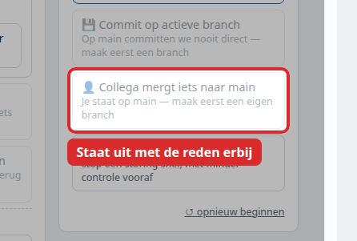

> Route 4 van 7. Terug naar de [Handleiding - start](start.md) · Vaste vorm: [Handleiding - sjabloon voor een route](sjabloon.md)

## Wanneer gebruik je dit

Je bent aan iets bezig, en ondertussen heeft iemand anders — een collega of een agent — iets samengevoegd. Je zijspoor vertrekt nu vanaf een station dat niet meer het laatste is.

Dit gebeurt bij ons **dagelijks**, want er werken meerdere agents tegelijk. Het is geen probleem; het is de normale gang van zaken. Het wordt pas een probleem als je het niet ziet.

## Voordat je begint

- Je hoeft hier meestal niets voor te doen. Git voegt per **regel** samen, niet per bestand. Twee mensen die verschillende stukken van hetzelfde bestand aanpassen gaan vanzelf goed.
- Het gaat alleen mis als jullie **dezelfde regels** aanraken. Daarom staat er in elk issue een regel **Raakt:** met de bestanden erbij.

---

## Stap 1 — Zien dat main is opgeschoven

**Wat je doet:** open je pull request en kijk onderaan, boven de knop om samen te voegen.

**Wat je hoort te zien:** één van deze drie:

| Wat er staat | Wat het betekent |
|---|---|
| Groen, geen melding | Er is niets aan de hand. Ga door |
| *This branch is out-of-date with the base branch* | Main is opgeschoven, maar er is geen botsing |
| *This branch has conflicts that must be resolved* | Jullie raakten dezelfde regels. Ga naar stap 3 |

**Klopt het niet:** zie je niets van dit alles, dan ben je waarschijnlijk niet ingelogd.

## Stap 2 — Bijwerken als er geen botsing is

**Wat je doet:** klik **Update branch**. GitHub haalt de nieuwe stand van main binnen jouw zijspoor.

**Wat je hoort te zien:** de controles starten opnieuw en de melding verdwijnt. Daarna kun je gewoon samenvoegen.

**Klopt het niet:** werk je met een agent, zeg dan dat main is opgeschoven en dat hij zijn branch moet bijwerken. Doe het niet zelf terwijl hij bezig is — dan werken jullie in hetzelfde bestand.

## Stap 3 — Als er wél een botsing is

**Wat je doet:** los het niet zelf op in de browser. Vraag Coder de botsing op te lossen op dezelfde branch, en zeg erbij welke wijziging van de ander erin moet blijven.

**Wat je hoort te zien:** een nieuwe commit op dezelfde pull request, en daarna verdwijnt de conflictmelding.

**Klopt het niet:** blijft het conflict terugkomen, dan werken er twee dingen tegelijk in hetzelfde bestand. Stop, en spreek af wie eerst gaat. Dat kost minder tijd dan om beurten hetzelfde oplossen.

## Stap 4 — Voorkomen dat het vaker gebeurt

**Wat je doet:** kijk bij het aanmaken van een issue naar de regel **Raakt:**. Loopt er al werk in hetzelfde bestand, laat dat dan eerst af komen.

**Wat je hoort te zien:** in het issue een regel als *"Botst met #105, dat hetzelfde bestand raakt. Bouw #105 eerst."*

**Klopt het niet:** staat die regel er niet en gaat het om `index.html`, ga er dan van uit dat er botsing is. Dat bestand is bij ons het drukste.

## Eindcontrole

1. Je pull request meldt geen conflict meer.
2. De controles zijn opnieuw gedraaid ná het bijwerken — niet alleen daarvoor.
3. Wat de ander maakte staat er nog steeds in. Kijk dat na in *Files changed*; het is de fout die het vaakst gemaakt wordt bij het oplossen van een botsing.

## Wat de simulatie hiervan laat zien

**Missie 14** — *laat een collega mergen terwijl jij op je eigen branch zit*. Klik op **Collega mergt iets naar main** terwijl je op je eigen zijspoor staat.

Je ziet main opschuiven terwijl jouw zijspoor aan het oudere station blijft hangen. Het logboek zegt het precies: dat is geen probleem zolang jullie niet dezelfde regels raken.

Let op: die knop werkt alleen als je op je eigen branch staat. Sta je op main, dan staat hij uit met de reden erbij — je kunt geen collega laten mergen naar de branch waar je zelf op staat.

*Je hoort hier te zien: de knop is grijs, met eronder de reden "Je staat op main — maak eerst een eigen branch". Zo hoort een knop die niet kan zich te gedragen.*
