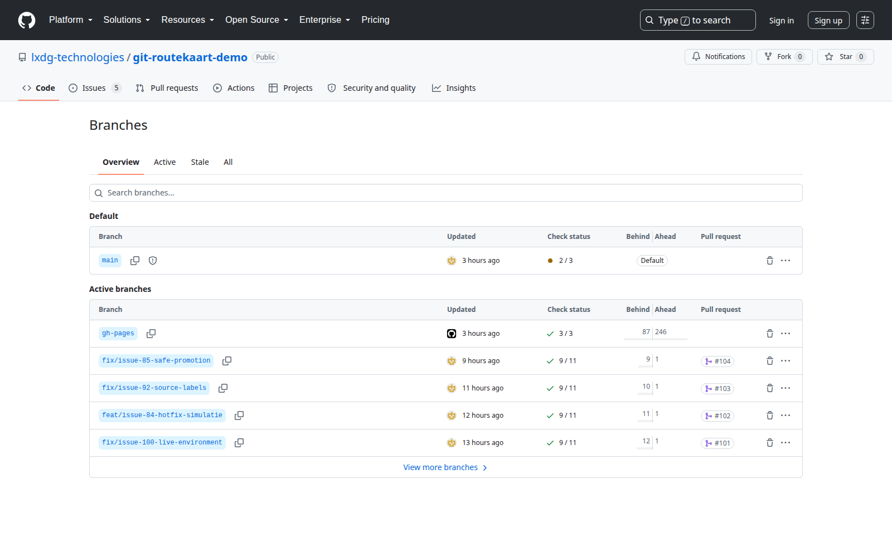

> Route 6 van 7. Terug naar de [Handleiding - start](start.md) · Vaste vorm: [Handleiding - sjabloon voor een route](sjabloon.md)

## Wanneer gebruik je dit

Je pull request is samengevoegd. Het zijspoor heeft zijn werk gedaan en mag weg.

Dit is de kortste route van allemaal — één klik — en tegelijk degene die het vaakst wordt overgeslagen. Op 10-08 stonden er **56 branches** in de repository, terwijl er maar één actief werd gebruikt.

## Voordat je begint

- Dit gaat **niet** vanzelf. In de instellingen van de repository staat *automatisch verwijderen na samenvoegen* uit.
- Je gooit niets weg dat je nodig hebt. Alle commits zitten na het samenvoegen in de hoofdlijn; de branch is alleen nog een naamkaartje.
- Verwijder alleen branches van pull requests die **samengevoegd** zijn.

---

## Stap 1 — Opruimen meteen na het samenvoegen

**Wat je doet:** direct nadat je op **Squash and merge** hebt geklikt, verschijnt op dezelfde plek een grijze knop **Delete branch**. Klik die.

**Wat je hoort te zien:** de knop verandert in *Restore branch*. Dat is de bevestiging dat het gelukt is — en meteen je vangnet als je je vergist.

**Klopt het niet:**
- Zie je de knop niet? Dan ben je niet ingelogd, of is er iemand je voor geweest.
- Ben je de pagina al kwijt? Ga naar stap 2.

## Stap 2 — Later opruimen

**Wat je doet:** open de [lijst met branches](https://github.com/lxdg-technologies/git-routekaart-demo/branches). Bovenaan staan vier tabbladen: **Overview**, **Active**, **Stale** en **All**. Er is géén tabblad met samengevoegde branches — je herkent ze aan de kolommen.

Kijk per regel naar twee dingen:

| Kolom | Wat je zoekt |
|---|---|
| **Pull request** | Een nummer, bijvoorbeeld `#104`. Klik erop en kijk of die op *Merged* staat |
| **Ahead** | Staat daar `1` of hoger, dan zit er nog werk in dat niet in `main` zit. Laat hem dan staan |

Is de pull request samengevoegd, klik dan op het **prullenbakje** helemaal rechts op die regel.

**Wat je hoort te zien:** de regel verdwijnt en het totaal bovenaan loopt met één terug.

**Klopt het niet:**
- Zie je geen prullenbakje? Dan ben je niet ingelogd of heb je de rechten niet.
- Staat er een schildje bij `main`? Dat is de beschermde hoofdlijn. Die blijft altijd staan.
- Staat er geen pull request in de kolom? Dan is er nooit een voorstel van gemaakt. Vraag ernaar voordat je hem weggooit.
- Zie je maar een handvol branches terwijl er tientallen zijn? Klik onderaan op **View more branches**, of ga naar het tabblad **All**.

*Je hoort hier te zien: vier tabbladen bovenaan, en per branch een kolom **Pull request** met het nummer. De vier onderste regels horen bij pull requests #101 tot en met #104 — allemaal allang samengevoegd, en toch staat de branch er nog. Precies waar deze route over gaat. Het prullenbakje staat helemaal rechts op elke regel.*

## Stap 3 — Weten wat je niet weggooit

**Wat je doet:** zie je een branch waarvan je de herkomst niet kent, laat hem staan en vraag ernaar.

**Wat je hoort te zien:** bij elke branch staat wanneer er voor het laatst aan gewerkt is. Alles ouder dan een paar weken zonder pull request is bijna altijd een restant.

**Klopt het niet:** heb je er per ongeluk een weggegooid, klik dan **Restore branch** op de pull request. Dat kan nog lang daarna.

## Eindcontrole

1. Bij jouw samengevoegde pull request staat *Restore branch*, niet *Delete branch*.
2. Het aantal branches is met precies één gedaald.

## Waarom dit ertoe doet

Een lijst van 56 branches maakt drie dingen kapot:

- Je kunt niet zien waar op dit moment aan gewerkt wordt.
- Het aanmaken van een nieuwe branch met dezelfde naam gaat mis.
- Het paneel op de routekaartpagina toont dat aantal aan bezoekers, en dat is geen goede reclame voor een pagina die over ordelijk werken gaat.

## Wat de simulatie hiervan laat zien

**Missie 7** — *ruim een gemergde branch op*. Nadat je hebt samengevoegd verschijnt rechts een knop **Verwijder branch** bij het zijspoor.

Klik hem en kijk naar de kaart: de oranje lijn verdwijnt, maar de stations die je maakte blijven op de blauwe lijn staan. Dat is precies wat er in het echt ook gebeurt — en het is de snelste manier om te snappen waarom opruimen veilig is.
